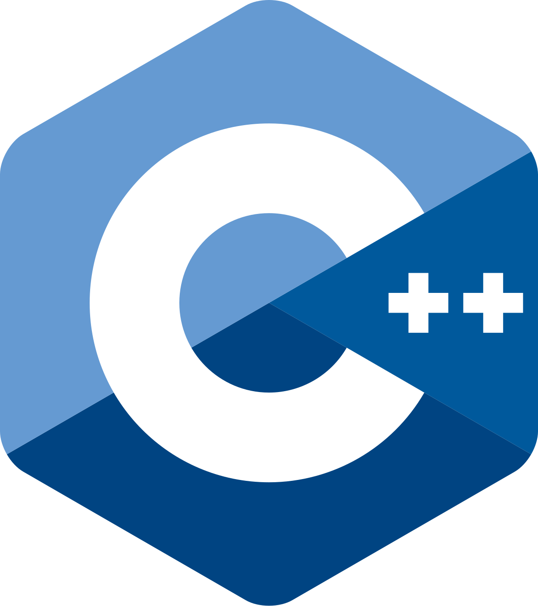

<table>
<tr style="border: none">
<td style="border: none">

# Task 01 – Chess with Polymorphism

</td>
<td align="right" style="border: none">

</td>
</tr>
</table>

This is the starter repository for **Task 01** of the Tel Hai Excellenteam (THE) C++ course.
Your goal is to implement a working chess engine using **object-oriented design and polymorphism**.

---

## How to Get This Repository

> 🚨 **Use "Use this template" — do NOT click Fork.**
>
> If you Fork this repository, your Pull Requests will target *this* template instead of your own repository, and your submission will not be graded.
>
> Click the green **"Use this template"** button at the top of this page → "Create a new repository".  
> This creates your own independent copy under your account.

---

## The Task

You are given a graphical engine (`Chess.h` / `Chess.cpp`) that handles all display and input.  
**Do not modify these files.**

Your job is to implement the chess logic in separate files (e.g., `Board.h`, `Board.cpp`, `Piece.h`, etc.) and plug it into `main.cpp`.

### What you need to implement

- An abstract `Piece` base class with a virtual method for move validation.
- Concrete piece classes: `Rook`, `Bishop`, `Queen`, `King`, `Knight`, `Pawn`.
- A `Board` class that owns the 8×8 piece matrix and checks move legality.

### Response codes

Your engine must return one of these codes to `chess.setCodeResponse()` after each move:

| `MoveResult` value          | Meaning                                                |
| --------------------------- | ------------------------------------------------------ |
| `NO_PIECE_AT_SOURCE`        | No piece at source square                              |
| `OPPONENT_PIECE`            | Source piece belongs to the opponent                   |
| `OWN_PIECE_AT_DEST`         | Destination occupied by your own piece                 |
| `ILLEGAL_MOVE`              | Illegal movement for that piece type (or path blocked) |
| `LEAVES_KING_IN_CHECK`      | Move would leave your own king in check                |
| `LEGAL_MOVE_CHECK`          | Legal move — puts opponent in check                    |
| `LEGAL_MOVE`                | Legal move                                             |

### Input format

Moves are entered as four characters: `<col><row><col><row>` (e.g., `A2A4` or `a2a4`).

- **Columns:** A–H (left to right)
- **Rows:** 1–8 (top to bottom, row 1 = white's back rank)

---

## Environment Setup

### Windows

Install [WSL 2](https://learn.microsoft.com/en-us/windows/wsl/install) with an Ubuntu distribution.

### macOS

**Option A — Native (recommended):**

Install the Xcode Command Line Tools:

```sh
xcode-select --install
```

Then install CMake via [Homebrew](https://brew.sh):

```sh
brew install cmake
```

**Option B — Ubuntu VM (VirtualBox):**

If you prefer to work inside a Linux environment:

1. Follow the instructions in this [video](https://www.youtube.com/watch?v=LjL_N0OZxvY) to install Ubuntu (no GUI) in VirtualBox.
2. To add a desktop GUI, follow this [guide](https://askubuntu.com/questions/53822/how-do-you-run-ubuntu-server-with-a-gui).
3. If you forget the default credentials, see this [article](https://www.debugpoint.com/virtualbox-id-password/).

Once inside Ubuntu, follow the **Linux** instructions below.

### Linux

```sh
sudo apt update
sudo apt install -y g++ cmake make
```

---

## Compilation Instructions

```sh
cmake -S . -B build
cmake --build build
./build/Chess
```

Any project that does not compile with these steps will not be graded.

---

## Repository Structure

Your submission must follow this structure:

```
.
├── CONTRIBUTING.md
├── .github/
│   └── workflows/
│       └── ci.yml
├── .gitignore
├── img/
├── README.md
├── CMakeLists.txt
├── include/
│   ├── Chess.h          ← do NOT modify
│   ├── Piece.h          ← your file
│   ├── Board.h          ← your file
│   └── ...
├── src/
│   ├── main.cpp         ← do NOT modify
│   ├── Chess.cpp        ← do NOT modify
│   ├── Piece.cpp        ← your file
│   ├── Board.cpp        ← your file
│   └── ...
└── tests/
    └── ...
```

- The repository **must not** include compiled binaries (`build/`, `.o` files, executables).
- 🚨 **Repositories without a workflow file at `.github/workflows/ci.yml` will not be graded.**

---

## Before you start — AI assistant rules

You **must** give **[AI_RULES.md](AI_RULES.md)** to your AI assistant **before** you ask it for help on this assignment:

- Paste the full text of `AI_RULES.md` into your first message to the AI, or attach it as context.
- Export the conversation with your AI assistant and include it in your Pull Request.

Your AI must follow the rules in that document. If you use more than one AI tool, give each one the same document at the start.

---

## How to Submit

1. Work on a **feature branch** (never push directly to `main`).
2. Open a **Pull Request** from your branch into `main` **of your own repository**.
3. Make sure all CI checks pass.
4. **Include your AI conversation export** in the PR (required).
5. Merge the PR and submit the repository link via Moodle.

See [CONTRIBUTING.md](CONTRIBUTING.md) for detailed branching guidelines.

---

## Code Style

This project includes a `.clang-format` file that defines the required code style.  
**Your submission will be reviewed with `clang-format` and deviations will result in a grade penalty.**

To check your code locally before submitting:
```sh
clang-format --dry-run --Werror src/*.cpp include/*.h
```

To auto-format:
```sh
clang-format -i src/*.cpp include/*.h
```

See [PRACTICES.md](PRACTICES.md) for full coding conventions.

---

## CI Checks

Every push and pull request runs the following checks automatically:

| Check | What it verifies |
|-------|-----------------|
| **Build (Linux)** | Project compiles without errors or warnings |
| **clang-tidy** | Static analysis — no common bugs or bad practices |

🚨 **Pull requests that fail CI will not be graded.**

---

## Grading and Conventions

For best practices please see [PRACTICES.md](PRACTICES.md).  
For branching and PR guidelines see [CONTRIBUTING.md](CONTRIBUTING.md).

### Pre-submission Checklist

1. All response codes are correctly implemented.
2. Code compiles cleanly with no warnings.
3. Code style matches `.clang-format` (run `clang-format --dry-run` to verify).
4. No unnecessary files are committed (check `.gitignore`).
5. CI workflow passes on GitHub.
6. You followed the branching and PR guidelines.
7. AI conversation export is included in the PR.
8. Repository link submitted on Moodle.

---

<p align="center">
  
  
</p>

<p align="center">
  
</p>
